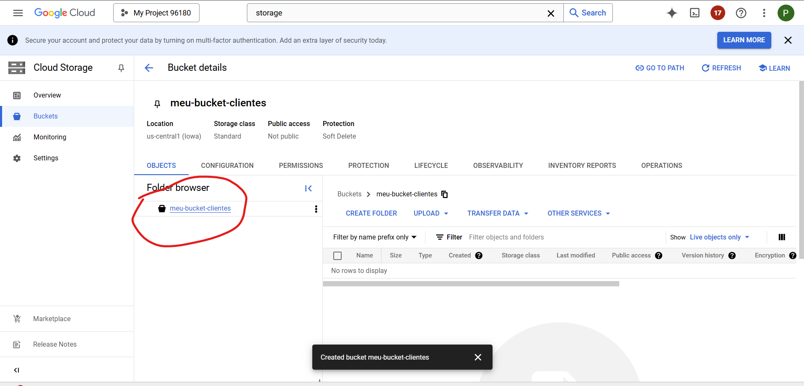

# Configurar o Ambiente no Google Cloud Console

a) Ativar APIs necessárias
No console do GCP, vá para APIs e Serviços > Biblioteca.
Ative as seguintes APIs:
Dataproc API
BigQuery API
Cloud Storage API


# Criar um Bucket no Cloud Storage
Acesse Cloud Storage no console: Cloud Storage.

Clique em Criar bucket.

Configure o bucket:

```
Nome: meu-bucket-clientes (ou o que preferir).
Região: us-central1.
```

Deixe as demais configurações padrão e clique em Criar.
Após criar o bucket, clique nele e faça upload do arquivo cliente.csv para a pasta input.

# Criar um Cluster no Dataproc
Acesse Dataproc no console: Dataproc Clusters.

Clique em Criar Cluster.

Configure o cluster:

Nome do cluster: meu-cluster-dataproc.
Região: us-central1.
Tipo: Cluster Single Node (apenas 1 nó).
Mantenha as demais configurações padrão.
Clique em Criar e aguarde o cluster ser provisionado.

# Criar o Script de Transformação
No editor de código local, crie o arquivo transforma_clientes.py com o seguinte conteúdo:
python
Copiar código
from pyspark.sql import SparkSession
from pyspark.sql.functions import when

# Inicializa a sessão Spark
spark = SparkSession.builder.appName("TransformaClientes").getOrCreate()

# Caminho do arquivo de entrada e saída no Cloud Storage

```
input_path = "gs://meu-bucket-clientes/input/cliente.csv"
output_path = "gs://meu-bucket-clientes/output/transformado/"
```

# Lê o arquivo CSV
df = spark.read.csv(input_path, header=True, sep=";")

# Adiciona a coluna "title" baseada no sexo
```
df_transformed = df.withColumn(
    "title", when(df["sexo"] == "M", "Mr").when(df["sexo"] == "F", "Ms")
)

```

# Grava os dados transformados no Cloud Storage como parquet
df_transformed.write.parquet(output_path, mode="overwrite")

spark.stop()
Faça o upload desse arquivo para o bucket Cloud Storage na pasta scripts.
5. Executar o Script no Dataproc
Vá para Dataproc > Jobs no console: Dataproc Jobs.

Clique em Criar Job.

Configure o job:

Nome do Job: transformar-clientes.
Tipo de Job: PySpark.
Arquivo principal: gs://meu-bucket-clientes/scripts/transforma_clientes.py.
Cluster: selecione meu-cluster-dataproc.
Clique em Enviar.

Acompanhe a execução do job no console. Quando o status mudar para Concluído, o arquivo transformado estará disponível no bucket output.

6. Carregar os Dados no BigQuery
Acesse BigQuery no console: BigQuery.

Crie um dataset:

Nome do dataset: clientes_dataset.
Região: us-central1.
Crie uma tabela no dataset:

Dataset: clientes_dataset.
Nome da tabela: tb_cliente.
Fonte dos dados: Google Cloud Storage.
Caminho do arquivo: gs://meu-bucket-clientes/output/transformado/*.parquet.
Formato do arquivo: Parquet.
Esquema: Detectar automaticamente.
Clique em Criar Tabela.

7. Verificar os Dados no BigQuery
Na seção Explorador, selecione o dataset clientes_dataset.
Clique em tb_cliente e depois em Pré-visualizar para ver os dados transformados.
Você verá a coluna title adicionada com os valores Mr ou Ms.

# Imagens




